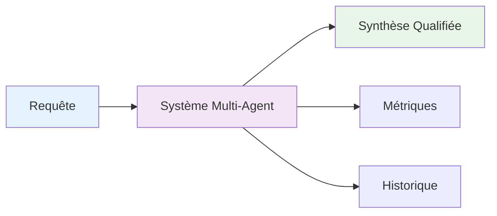
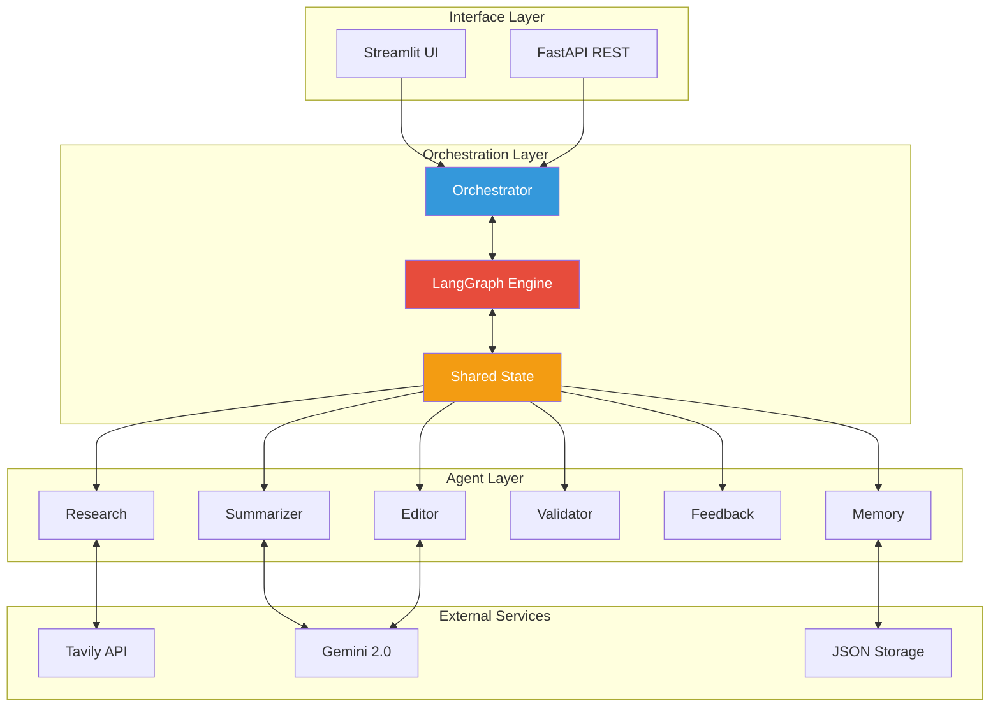
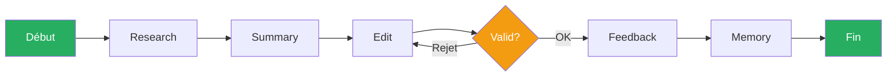
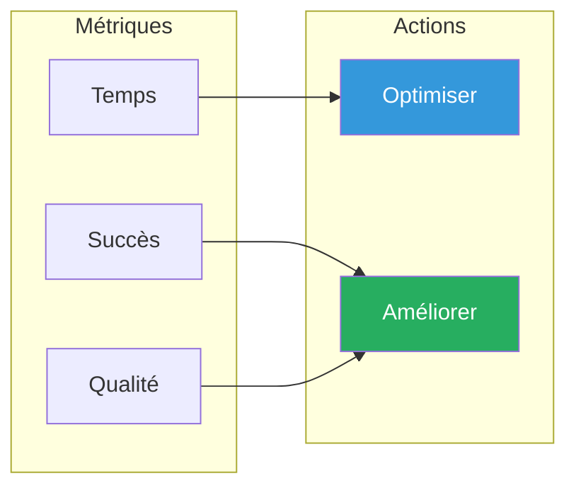
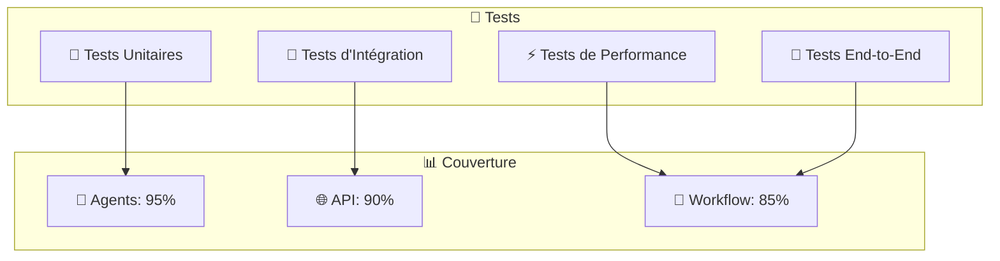
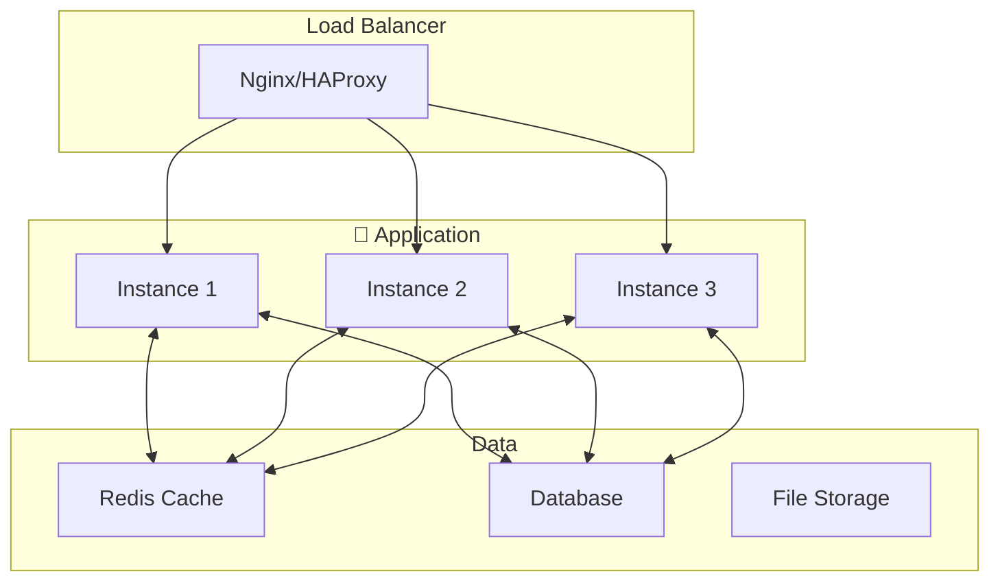

#  Assistant de Recherche Multi-Agent

<div align="center">


**Un système multi-agent intelligent orchestré avec LangGraph pour la recherche et l'analyse d'informations automatisées**

[ Documentation](#-documentation) • [🚀 Installation](#-installation-rapide) • [🎯 Démo](#-démo) • [🤝 Contribution](#-contribution)

</div>

---

##  Table des Matières

- [ Aperçu](#-aperçu)
- [ Architecture](#️-architecture)
- [ Fonctionnalités](#-fonctionnalités)
- [ Installation Rapide](#-installation-rapide)
- [ Utilisation](#-utilisation)
- [ Workflow](#-workflow)
- [ Configuration](#-configuration)
- [ API Documentation](#-api-documentation)
- [ Tests](#-tests)
- [ Docker](#-docker)
- [ Performance](#-performance)
- [ Contribution](#-contribution)
- [ License](#-license)

---

##  Aperçu

L'**Assistant de Recherche Multi-Agent** est un système d'intelligence artificielle avancé qui automatise le processus de recherche, d'analyse et de synthèse d'informations. Utilisant une architecture multi-agent orchestrée par **LangGraph**, le système coordonne sept agents spécialisés pour produire des analyses de haute qualité.

###  Problème Résolu

- **Recherche manuelle chronophage** → Automatisation intelligente
- **Qualité variable des synthèses** → Validation multi-niveau
- **Manque de traçabilité** → Historique complet et métriques
- **Formats rigides** → Adaptation stylistique dynamique

###  Valeur Ajoutée



---

##  Architecture

###  Vue d'Ensemble



###  Agents Spécialisés

| Agent | Rôle | Technologie | Description |
|-------|------|-------------|-------------|
|  **Research** | Recherche Web | Tavily API | Collecte d'informations contextualisées |
|  **Summarizer** | Synthèse | Gemini 2.0 | Résumé intelligent et structuré |
|  **Editor** | Édition | Gemini 2.0 | Adaptation stylistique du contenu |
|  **Validator** | Validation | Logique métier | Contrôle qualité multi-critères |
|  **Feedback** | Retours | Système interne | Collecte et analyse des retours |
| **Memory** | Persistance | JSON/Redis | Historique et métriques |

---

##  Fonctionnalités

###  Fonctionnalités Principales

- **Recherche Intelligente** : Utilisation de l'API Tavily pour des résultats pertinents
- **Synthèse Automatique** : Génération de résumés structurés avec Gemini 2.0
- **Adaptation Stylistique** : Support de 4 styles (académique, journalistique, technique, vulgarisation)
- **Validation Multi-Niveau** : Contrôle qualité automatique et validation humaine
- **Métriques Avancées** : Suivi des performances et de la qualité
- **Mémoire Persistante** : Historique complet des recherches

###  Fonctionnalités Avancées

- **Orchestration LangGraph** : Workflows complexes avec branchements conditionnels
- **Interface Utilisateur** : Streamlit pour l'interaction intuitive
- **API REST** : Intégration facile avec d'autres systèmes
- **Docker Ready** : Déploiement simplifié
- **Monitoring** : Tableaux de bord de performance
- **Configuration Flexible** : Paramétrage via variables d'environnement

---

## Installation Rapide

###  Prérequis

- **Python 3.11+**
- **Clés API** :
  - [Google Gemini API](https://makersuite.google.com/app/apikey)
  - [Tavily API](https://tavily.com/)

###  Installation en 3 étapes

```bash
# 1️ Cloner le projet
git clone https://github.com/votre-username/assistant-recherche-multi-agent.git
cd assistant-recherche-multi-agent

# 2️ Installer les dépendances
pip install -r requirements.txt

# 3️ Configurer les variables d'environnement
cp .env.example .env
# Éditez .env avec vos clés API
```

###  Configuration Rapide

```bash
# .env
GEMINI_API_KEY=your_gemini_api_key_here
TAVILY_API_KEY=your_tavily_api_key_here
```

###  Lancement

```bash
# Démarrer l'API
python main.py

# Ou avec l'interface Streamlit
streamlit run app_streamlit.py
```

---

##  Utilisation

###  Via l'API REST

```bash
curl -X POST "http://localhost:8000/research" \
  -H "Content-Type: application/json" \
  -d '{
    "query": "Intelligence artificielle générative en 2024",
    "style": "académique",
    "max_results": 5
  }'
```

###  Via l'Interface Streamlit

1. **Accédez** à `http://localhost:8501`
2. **Saisissez** votre requête de recherche
3. **Sélectionnez** le style de rédaction
4. **Lancez** le processus multi-agent
5. **Interagissez** avec les résultats intermédiaires

###  Via Python

```python
from orchestrator import orchestrator
import asyncio

async def main():
    result = await orchestrator.process_research_request(
        query="Intelligence artificielle en 2024",
        style="académique"
    )
    print(result.final_result)

asyncio.run(main())
```

---

##  Workflow

###  Flux Principal



###  Métriques Collectées



###  Styles de Rédaction

| Style | Caractéristiques | Cas d'usage |
|-------|------------------|-------------|
| **Académique** | Langage précis, références, structure claire | Publications, recherches |
| **Journalistique** | Accessible, titres accrocheurs | Articles, blog posts |
| **Technique** | Terminologie spécialisée, précision | Documentation, specs |
| **Vulgarisation** | Concepts simplifiés, exemples | Formation, présentation |

---

##  Configuration

###  Variables d'Environnement

```bash
# APIs
GEMINI_API_KEY=your_gemini_api_key
TAVILY_API_KEY=your_tavily_api_key

# Configuration Gemini
GEMINI_MODEL=gemini-2.0-flash-exp
GEMINI_TEMPERATURE=0.7
GEMINI_MAX_TOKENS=4000

# Configuration Tavily
TAVILY_MAX_RESULTS=5
TAVILY_SEARCH_DEPTH=advanced

# Stockage
MEMORY_FILE=research_memory.json
```

###  Configuration Avancée

```python
# config.py
class Config:
    # Modèles
    GEMINI_MODEL = "gemini-2.0-flash-exp"
    GEMINI_TEMPERATURE = 0.7
    
    # Recherche
    TAVILY_MAX_RESULTS = 5
    TAVILY_SEARCH_DEPTH = "advanced"
    
    # Performance
    API_RATE_LIMIT = 100
    SESSION_TIMEOUT = 3600
```

---

##  API Documentation

###  Endpoints Principaux

| Endpoint | Méthode | Description | Statut |
|----------|---------|-------------|---------|
| `/` | GET | Point d'entrée | ✅ |
| `/health` | GET | État de santé | ✅ |
| `/research` | POST | Lancer une recherche | ✅ |
| `/memory` | GET | Historique complet | ✅ |
| `/memory/stats` | GET | Statistiques | ✅ |
| `/memory` | DELETE | Effacer l'historique | ✅ |

###  Exemple de Réponse

```json
{
  "query": "Intelligence artificielle en 2024",
  "final_content": "L'intelligence artificielle en 2024...",
  "search_results": [...],
  "summary": "Résumé des recherches...",
  "edited_content": "Contenu adapté au style...",
  "validation_status": true,
  "feedback": "Excellente synthèse",
  "timestamp": "2024-01-15T10:30:00Z",
  "processing_time": 25.7
}
```

###  Documentation Interactive

- **Swagger UI** : `http://localhost:8000/docs`
- **ReDoc** : `http://localhost:8000/redoc`

---

##  Tests

###  Stratégie de Test



###  Exécution des Tests

```bash
# Tests unitaires
pytest tests/unit/

# Tests d'intégration
pytest tests/integration/

# Tests de performance
pytest tests/performance/

# Couverture complète
pytest --cov=. --cov-report=html
```

###  Rapports de Test

```bash
# Générer un rapport de couverture
coverage run -m pytest
coverage html
# Ouvrir htmlcov/index.html
```

---

##  Docker

###  Build et Run

```bash
# Build de l'image
docker build -t research-assistant .

# Lancement du conteneur
docker run -d -p 8000:8000 \
  -e GEMINI_API_KEY=your_key \
  -e TAVILY_API_KEY=your_key \
  research-assistant
```

###  Docker Compose

```yaml
# docker-compose.yml
version: '3.8'
services:
  research-assistant:
    build: .
    ports:
      - "8000:8000"
    environment:
      - GEMINI_API_KEY=${GEMINI_API_KEY}
      - TAVILY_API_KEY=${TAVILY_API_KEY}
    volumes:
      - ./data:/app/data
    restart: unless-stopped
```

```bash
# Lancement avec Docker Compose
docker-compose up -d
```

###  Architecture de Déploiement



---

##  Performance

###  Métriques Clés

| Métrique | Valeur | Objectif |
|----------|--------|----------|
| **Temps de traitement** | 15-30s | < 45s |
| **Taux de succès** | 95% | > 90% |
| **Taux de validation** | 90% | > 85% |
| **Disponibilité** | 99.5% | > 99% |
| **Usage mémoire** | < 512MB | < 1GB |

###  Benchmarks

```bash
# Test de charge avec Apache Bench
ab -n 100 -c 10 http://localhost:8000/health

# Test de performance avec pytest-benchmark
pytest tests/performance/ --benchmark-only
```

###  Optimisations

- **Cache intelligent** : Redis pour les résultats fréquents
- **Parallélisation** : Traitement concurrent des requêtes
- **Rate limiting** : Protection contre la surcharge
- **Connection pooling** : Optimisation des connexions API

---


###  Vision Long Terme

- [ ]  **Agents autonomes** (Auto-amélioration)
- [ ]  **Multi-modalité** (Images, audio, vidéo)
- [ ]  **Réseau d'agents** (Collaboration inter-systèmes)
- [ ]  **AGI Integration** (Capacités générales)

---

## Statistiques du Projet

<div align="center">


</div>

---

## 📄 License

Ce projet est sous licence **MIT**. Voir le fichier [LICENSE](LICENSE) pour plus de détails.

```
MIT License

Copyright (c) 2024 Assistant de Recherche Multi-Agent

Permission is hereby granted, free of charge, to any person obtaining a copy
of this software and associated documentation files (the "Software"), to deal
in the Software without restriction...
```

---

##  Remerciements

###  Technologies Utilisées

- **[LangGraph](https://python.langchain.com/docs/langgraph)** - Orchestration multi-agent
- **[FastAPI](https://fastapi.tiangolo.com/)** - Framework API moderne
- **[Google Gemini](https://deepmind.google/technologies/gemini/)** - Modèle de langage avancé
- **[Tavily](https://tavily.com/)** - API de recherche intelligente
- **[Streamlit](https://streamlit.io/)** - Interface utilisateur intuitive


---

##  Contact & Support
- abdelilahourti@gmail.com


---

<div align="center">

**⭐ Si ce projet vous plaît, n'hésitez pas à lui donner une étoile ! ⭐**

Développé  par Ourti Abdelilah
