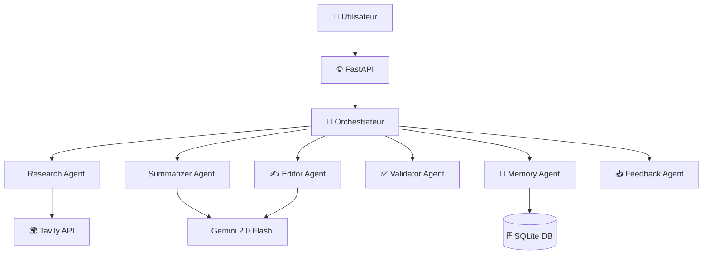

# 🤖 Système Multi-Agent de Recherche Intelligente

Un système avancé de recherche et traitement d'information utilisant plusieurs agents IA spécialisés pour fournir des résultats de haute qualité avec validation humaine.

## 🎯 Vue d'ensemble

Ce projet implémente un **Système Multi-Agent (SMA)** composé de 7 agents spécialisés qui collaborent pour effectuer des recherches intelligentes, générer des résumés de qualité, et produire du contenu édité selon différents styles.

### Agents du système

1. **🔎 Research Agent** - Recherche web via l'API Tavily
2. **📝 Summarizer Agent** - Résumés intelligents avec Gemini 2.0 Flash
3. **✍️ Editor Agent** - Édition et adaptation de style
4. **✅ Human Validator Agent** - Validation humaine (simulée ou réelle)
5. **📥 Feedback Agent** - Collecte et analyse des retours
6. **🧠 Orchestrator Agent** - Coordination du workflow
7. **💾 Memory Agent** - Persistance et historique

## 🚀 Installation et Configuration

### Prérequis

- Python 3.8+
- Clé API Gemini 2.0 Flash
- Clé API Tavily Search

### Installation

1. **Clonez le projet**
```bash
git clone <repository-url>
cd système-multi-agent-recherche
```

2. **Installez les dépendances**
```bash
pip install -r requirements.txt
```

3. **Configuration des clés API**
```bash
cp .env.example .env
# Éditez .env avec vos clés API
```

4. **Lancez le système**
```bash
python main.py
```

L'API sera disponible sur `http://localhost:8000`

## 📋 Utilisation

### Via l'API REST

```bash
# Workflow complet
curl -X POST "http://localhost:8000/workflow" \
  -H "Content-Type: application/json" \
  -d '{"query": "Intelligence artificielle générative"}'

# Vérification de l'état
curl "http://localhost:8000/health"
```

### Via le script de démonstration

```bash
python demo.py
```

### Via l'interface web

Accédez à `http://localhost:8000/docs` pour l'interface Swagger interactive.

## 🏗️ Architecture



## 🔧 Configuration

### Variables d'environnement

| Variable | Description | Requis |
|----------|-------------|---------|
| `GEMINI_API_KEY` | Clé API Gemini 2.0 Flash | ✅ |
| `TAVILY_API_KEY` | Clé API Tavily Search | ✅ |
| `DATABASE_PATH` | Chemin base de données | ❌ |
| `HOST` | Host du serveur | ❌ |
| `PORT` | Port du serveur | ❌ |

### Modes de fonctionnement

- **Mode Simulation** : Validation automatique simulée
- **Mode Production** : Validation humaine réelle
- **Mode Debug** : Logs détaillés pour le développement

## 📊 Endpoints principaux

### Workflow
- `POST /workflow` - Exécute un workflow complet
- `GET /task/{task_id}` - Statut d'une tâche
- `DELETE /task/{task_id}` - Annule une tâche

### Agents individuels
- `POST /research` - Recherche uniquement
- `POST /summarize` - Résumé uniquement
- `POST /edit` - Édition uniquement
- `POST /validate` - Validation uniquement

### Feedback et métriques
- `POST /feedback` - Soumet un feedback
- `GET /feedback/overall` - Performances globales
- `GET /feedback/performance/{agent}` - Performance par agent

### Mémoire
- `GET /memory/search` - Recherche dans l'historique
- `GET /memory/statistics` - Statistiques de la base

## 🧪 Tests et démonstration

### Démonstration complète
```bash
python demo.py
# Choisir l'option 1 pour la démo complète
```

### Test rapide
```bash
python demo.py
# Choisir l'option 2 pour un test rapide
```

### Tests unitaires
```bash
# À implémenter selon vos besoins
pytest tests/
```

## 📈 Métriques et monitoring

Le système fournit des métriques détaillées :

- **Performance des agents** : Temps d'exécution, taux de succès
- **Qualité du contenu** : Notes de validation, feedback utilisateur
- **Utilisation système** : Nombre de tâches, patterns d'usage
- **Santé globale** : État des APIs, base de données

## 🔍 Exemples d'utilisation

### Workflow simple
```python
from models import WorkflowRequest
from agents.orchestrator_agent import OrchestratorAgent

orchestrator = OrchestratorAgent()
request = WorkflowRequest(query="Blockchain applications")
result = await orchestrator.execute_workflow(request)
```

### Agent individuel
```python
from agents.research_agent import ResearchAgent
from models import ResearchRequest

agent = ResearchAgent()
request = ResearchRequest(query="Machine learning", max_results=5)
results = agent.search(request)
```

## 🛠️ Personnalisation

### Nouveaux styles d'édition
```python
# Dans editor_agent.py
self.available_styles["mon_style"] = "Description du style"
```

### Critères de validation personnalisés
```python
# Dans validator_agent.py
agent.set_validation_criteria("custom", ["Critère 1", "Critère 2"])
```

### Workflow personnalisé
```python
custom_workflow = [
    WorkflowStage.RESEARCH,
    WorkflowStage.SUMMARIZE,
    WorkflowStage.COMPLETE
]
```

## 📚 Structure du projet

```
système-multi-agent/
├── agents/                 # Agents spécialisés
│   ├── research_agent.py
│   ├── summarizer_agent.py
│   ├── editor_agent.py
│   ├── validator_agent.py
│   ├── feedback_agent.py
│   ├── memory_agent.py
│   └── orchestrator_agent.py
├── models.py              # Modèles de données
├── config.py              # Configuration
├── main.py                # API FastAPI
├── demo.py                # Script de démonstration
├── requirements.txt       # Dépendances
├── .env.example          # Template de configuration
└── README.md             # Cette documentation
```

## 🚨 Limitations et considérations

### Limitations actuelles
- Dépendance aux APIs externes (Gemini, Tavily)
- Mode validation humaine simplifié
- Pas de cache distribué pour le scale

### Considérations de sécurité
- Protégez vos clés API
- Validez les entrées utilisateur
- Limitez les requêtes simultanées

### Performance
- Optimisé pour ~100 requêtes/heure
- Temps de réponse : 10-60 secondes par workflow
- Base SQLite adaptée pour <10k tâches

## 🔮 Évolutions futures

### Fonctionnalités plannifiées
- [ ] Cache Redis pour améliorer les performances
- [ ] Interface web complète
- [ ] Support multi-langues
- [ ] Intégration avec d'autres LLMs
- [ ] Analytics avancés
- [ ] API webhooks pour notifications

### Améliorations techniques
- [ ] Tests unitaires complets
- [ ] Déploiement Docker
- [ ] CI/CD pipeline
- [ ] Monitoring avec Prometheus
- [ ] Documentation API OpenAPI complète

## 🤝 Contribution

1. Fork le projet
2. Créez une branche feature (`git checkout -b feature/ma-feature`)
3. Commitez vos changements (`git commit -am 'Ajoute ma feature'`)
4. Push sur la branche (`git push origin feature/ma-feature`)
5. Ouvrez une Pull Request

## 📄 Licence

Ce projet est sous licence MIT. Voir le fichier `LICENSE` pour plus de détails.

## 🆘 Support

- **Documentation** : `/docs` endpoint de l'API
- **Issues** : Utilisez le système d'issues GitHub
- **Discussions** : GitHub Discussions pour les questions

## 🏆 Remerciements

- **Gemini 2.0 Flash** pour les capacités de résumé et édition
- **Tavily** pour l'API de recherche web
- **FastAPI** pour le framework web
- **SQLite** pour la persistance simple et efficace

---

*Développé avec ❤️ pour démontrer les capacités des systèmes multi-agents*