# 🤖 Assistant de Recherche Multi-Agent

<div align="center">


**Un système multi-agent intelligent orchestré avec LangGraph pour la recherche et l'analyse d'informations automatisées**

[📖 Documentation](#-documentation) • [🚀 Installation](#-installation-rapide) • [🎯 Démo](#-démo) • [🤝 Contribution](#-contribution)

</div>

---

## 📋 Table des Matières

- [🌟 Aperçu](#-aperçu)
- [🏗️ Architecture](#️-architecture)
- [✨ Fonctionnalités](#-fonctionnalités)
- [🚀 Installation Rapide](#-installation-rapide)
- [🎯 Utilisation](#-utilisation)
- [📊 Workflow](#-workflow)
- [🔧 Configuration](#-configuration)
- [📚 API Documentation](#-api-documentation)
- [🧪 Tests](#-tests)
- [🐳 Docker](#-docker)
- [📈 Performance](#-performance)
- [🤝 Contribution](#-contribution)
- [📄 License](#-license)

---

## 🌟 Aperçu

L'**Assistant de Recherche Multi-Agent** est un système d'intelligence artificielle avancé qui automatise le processus de recherche, d'analyse et de synthèse d'informations. Utilisant une architecture multi-agent orchestrée par **LangGraph**, le système coordonne sept agents spécialisés pour produire des analyses de haute qualité.

### 🎯 Problème Résolu

- **Recherche manuelle chronophage** → Automatisation intelligente
- **Qualité variable des synthèses** → Validation multi-niveau
- **Manque de traçabilité** → Historique complet et métriques
- **Formats rigides** → Adaptation stylistique dynamique

### 🚀 Valeur Ajoutée

```mermaid
graph LR
    A[📝 Requête] --> B[🤖 Système Multi-Agent] --> C[📄 Synthèse Qualifiée]
    B --> D[📊 Métriques] 
    B --> E[🗄️ Historique]
    
    style A fill:#e3f2fd
    style B fill:#f3e5f5
    style C fill:#e8f5e8
```



---

## 🏗️ Architecture

### 🧩 Vue d'Ensemble

```mermaid
graph TB
    subgraph "🖥️ Interface Layer"
        UI[Streamlit UI]
        API[FastAPI REST]
    end
    
    subgraph "🧠 Orchestration Layer"
        ORCH[Orchestrator]
        LG[LangGraph Engine]
        STATE[Shared State]
    end
    
    subgraph "🤖 Agent Layer"
        RA[🔍 Research]
        SA[📝 Summarizer]
        EA[✍️ Editor]
        VA[✅ Validator]
        FA[💬 Feedback]
        MA[🗄️ Memory]
    end
    
    subgraph "🌐 External Services"
        TAVILY[Tavily API]
        GEMINI[Gemini 2.0]
        STORAGE[JSON Storage]
    end
    
    UI --> ORCH
    API --> ORCH
    ORCH <--> LG
    LG <--> STATE
    
    STATE --> RA
    STATE --> SA
    STATE --> EA
    STATE --> VA
    STATE --> FA
    STATE --> MA
    
    RA <--> TAVILY
    SA <--> GEMINI
    EA <--> GEMINI
    MA <--> STORAGE
    
    style ORCH fill:#3498db,color:#fff
    style LG fill:#e74c3c,color:#fff
    style STATE fill:#f39c12,color:#fff
```



### 🤖 Agents Spécialisés

| Agent | Rôle | Technologie | Description |
|-------|------|-------------|-------------|
| 🔍 **Research** | Recherche Web | Tavily API | Collecte d'informations contextualisées |
| 📝 **Summarizer** | Synthèse | Gemini 2.0 | Résumé intelligent et structuré |
| ✍️ **Editor** | Édition | Gemini 2.0 | Adaptation stylistique du contenu |
| ✅ **Validator** | Validation | Logique métier | Contrôle qualité multi-critères |
| 💬 **Feedback** | Retours | Système interne | Collecte et analyse des retours |
| 🗄️ **Memory** | Persistance | JSON/Redis | Historique et métriques |

---

## ✨ Fonctionnalités

### 🎯 Fonctionnalités Principales

- **🔍 Recherche Intelligente** : Utilisation de l'API Tavily pour des résultats pertinents
- **📝 Synthèse Automatique** : Génération de résumés structurés avec Gemini 2.0
- **✍️ Adaptation Stylistique** : Support de 4 styles (académique, journalistique, technique, vulgarisation)
- **✅ Validation Multi-Niveau** : Contrôle qualité automatique et validation humaine
- **📊 Métriques Avancées** : Suivi des performances et de la qualité
- **🗄️ Mémoire Persistante** : Historique complet des recherches

### 🚀 Fonctionnalités Avancées

- **🔄 Orchestration LangGraph** : Workflows complexes avec branchements conditionnels
- **🎨 Interface Utilisateur** : Streamlit pour l'interaction intuitive
- **🌐 API REST** : Intégration facile avec d'autres systèmes
- **🐳 Docker Ready** : Déploiement simplifié
- **📈 Monitoring** : Tableaux de bord de performance
- **🔧 Configuration Flexible** : Paramétrage via variables d'environnement

---

## 🚀 Installation Rapide

### 📋 Prérequis

- **Python 3.11+**
- **Clés API** :
  - [Google Gemini API](https://makersuite.google.com/app/apikey)
  - [Tavily API](https://tavily.com/)

### ⚡ Installation en 3 étapes

```bash
# 1️⃣ Cloner le projet
git clone https://github.com/votre-username/assistant-recherche-multi-agent.git
cd assistant-recherche-multi-agent

# 2️⃣ Installer les dépendances
pip install -r requirements.txt

# 3️⃣ Configurer les variables d'environnement
cp .env.example .env
# Éditez .env avec vos clés API
```

### 🔧 Configuration Rapide

```bash
# .env
GEMINI_API_KEY=your_gemini_api_key_here
TAVILY_API_KEY=your_tavily_api_key_here
```

### 🎯 Lancement

```bash
# Démarrer l'API
python main.py

# Ou avec l'interface Streamlit
streamlit run app_streamlit.py
```

---

## 🎯 Utilisation

### 🌐 Via l'API REST

```bash
curl -X POST "http://localhost:8000/research" \
  -H "Content-Type: application/json" \
  -d '{
    "query": "Intelligence artificielle générative en 2024",
    "style": "académique",
    "max_results": 5
  }'
```

### 🖥️ Via l'Interface Streamlit

1. **Accédez** à `http://localhost:8501`
2. **Saisissez** votre requête de recherche
3. **Sélectionnez** le style de rédaction
4. **Lancez** le processus multi-agent
5. **Interagissez** avec les résultats intermédiaires

### 🐍 Via Python

```python
from orchestrator import orchestrator
import asyncio

async def main():
    result = await orchestrator.process_research_request(
        query="Intelligence artificielle en 2024",
        style="académique"
    )
    print(result.final_result)

asyncio.run(main())
```

---

## 📊 Workflow

### 🔄 Flux Principal

```mermaid
flowchart LR
    A[🚀 Début] --> B[🔍 Research] --> C[📝 Summary] --> D[✍️ Edit] --> E{✅ Valid?}
    E -->|❌ Rejet| D
    E -->|✅ OK| F[💬 Feedback] --> G[🗄️ Memory] --> H[🏁 Fin]
    
    style A fill:#27ae60,color:#fff
    style H fill:#27ae60,color:#fff
    style E fill:#f39c12,color:#fff
```



### 📈 Métriques Collectées

```mermaid
graph LR
    subgraph "📊 Métriques"
        TIME[⏱️ Temps]
        SUCCESS[✅ Succès]
        QUALITY[💎 Qualité]
    end
    
    subgraph "🎯 Actions"
        OPTIMIZE[⚡ Optimiser]
        IMPROVE[🔧 Améliorer]
    end
    
    TIME --> OPTIMIZE
    SUCCESS --> IMPROVE
    QUALITY --> IMPROVE
    
    style OPTIMIZE fill:#3498db,color:#fff
    style IMPROVE fill:#27ae60,color:#fff
```



### 🎨 Styles de Rédaction

| Style | Caractéristiques | Cas d'usage |
|-------|------------------|-------------|
| **🎓 Académique** | Langage précis, références, structure claire | Publications, recherches |
| **📰 Journalistique** | Accessible, titres accrocheurs | Articles, blog posts |
| **🔧 Technique** | Terminologie spécialisée, précision | Documentation, specs |
| **🗣️ Vulgarisation** | Concepts simplifiés, exemples | Formation, présentation |

---

## 🔧 Configuration

### ⚙️ Variables d'Environnement

```bash
# APIs
GEMINI_API_KEY=your_gemini_api_key
TAVILY_API_KEY=your_tavily_api_key

# Configuration Gemini
GEMINI_MODEL=gemini-2.0-flash-exp
GEMINI_TEMPERATURE=0.7
GEMINI_MAX_TOKENS=4000

# Configuration Tavily
TAVILY_MAX_RESULTS=5
TAVILY_SEARCH_DEPTH=advanced

# Stockage
MEMORY_FILE=research_memory.json
```

### 🎛️ Configuration Avancée

```python
# config.py
class Config:
    # Modèles
    GEMINI_MODEL = "gemini-2.0-flash-exp"
    GEMINI_TEMPERATURE = 0.7
    
    # Recherche
    TAVILY_MAX_RESULTS = 5
    TAVILY_SEARCH_DEPTH = "advanced"
    
    # Performance
    API_RATE_LIMIT = 100
    SESSION_TIMEOUT = 3600
```

---

## 📚 API Documentation

### 🔌 Endpoints Principaux

| Endpoint | Méthode | Description | Statut |
|----------|---------|-------------|---------|
| `/` | GET | Point d'entrée | ✅ |
| `/health` | GET | État de santé | ✅ |
| `/research` | POST | Lancer une recherche | ✅ |
| `/memory` | GET | Historique complet | ✅ |
| `/memory/stats` | GET | Statistiques | ✅ |
| `/memory` | DELETE | Effacer l'historique | ✅ |

### 📝 Exemple de Réponse

```json
{
  "query": "Intelligence artificielle en 2024",
  "final_content": "L'intelligence artificielle en 2024...",
  "search_results": [...],
  "summary": "Résumé des recherches...",
  "edited_content": "Contenu adapté au style...",
  "validation_status": true,
  "feedback": "Excellente synthèse",
  "timestamp": "2024-01-15T10:30:00Z",
  "processing_time": 25.7
}
```

### 📖 Documentation Interactive

- **Swagger UI** : `http://localhost:8000/docs`
- **ReDoc** : `http://localhost:8000/redoc`

---

## 🧪 Tests

### 🔬 Stratégie de Test

```mermaid
graph TB
    subgraph "🧪 Tests"
        UNIT[🔬 Tests Unitaires]
        INTEGRATION[🔗 Tests d'Intégration]
        PERFORMANCE[⚡ Tests de Performance]
        E2E[🎯 Tests End-to-End]
    end
    
    subgraph "📊 Couverture"
        AGENTS[🤖 Agents: 95%]
        API[🌐 API: 90%]
        WORKFLOW[🔄 Workflow: 85%]
    end
    
    UNIT --> AGENTS
    INTEGRATION --> API
    PERFORMANCE --> WORKFLOW
    E2E --> WORKFLOW
```



### 🚀 Exécution des Tests

```bash
# Tests unitaires
pytest tests/unit/

# Tests d'intégration
pytest tests/integration/

# Tests de performance
pytest tests/performance/

# Couverture complète
pytest --cov=. --cov-report=html
```

### 📊 Rapports de Test

```bash
# Générer un rapport de couverture
coverage run -m pytest
coverage html
# Ouvrir htmlcov/index.html
```

---

## 🐳 Docker

### 🏗️ Build et Run

```bash
# Build de l'image
docker build -t research-assistant .

# Lancement du conteneur
docker run -d -p 8000:8000 \
  -e GEMINI_API_KEY=your_key \
  -e TAVILY_API_KEY=your_key \
  research-assistant
```

### 🚀 Docker Compose

```yaml
# docker-compose.yml
version: '3.8'
services:
  research-assistant:
    build: .
    ports:
      - "8000:8000"
    environment:
      - GEMINI_API_KEY=${GEMINI_API_KEY}
      - TAVILY_API_KEY=${TAVILY_API_KEY}
    volumes:
      - ./data:/app/data
    restart: unless-stopped
```

```bash
# Lancement avec Docker Compose
docker-compose up -d
```

### 🎯 Architecture de Déploiement

```mermaid
graph TB
    subgraph "🌐 Load Balancer"
        LB[Nginx/HAProxy]
    end
    
    subgraph "📱 Application"
        APP1[Instance 1]
        APP2[Instance 2]
        APP3[Instance 3]
    end
    
    subgraph "💾 Data"
        CACHE[Redis Cache]
        DB[Database]
        STORAGE[File Storage]
    end
    
    LB --> APP1
    LB --> APP2
    LB --> APP3
    
    APP1 <--> CACHE
    APP2 <--> CACHE
    APP3 <--> CACHE
    
    APP1 <--> DB
    APP2 <--> DB
    APP3 <--> DB
```



---

## 📈 Performance

### 🎯 Métriques Clés

| Métrique | Valeur | Objectif |
|----------|--------|----------|
| **⏱️ Temps de traitement** | 15-30s | < 45s |
| **✅ Taux de succès** | 95% | > 90% |
| **🎯 Taux de validation** | 90% | > 85% |
| **🚀 Disponibilité** | 99.5% | > 99% |
| **💾 Usage mémoire** | < 512MB | < 1GB |

### 📊 Benchmarks

```bash
# Test de charge avec Apache Bench
ab -n 100 -c 10 http://localhost:8000/health

# Test de performance avec pytest-benchmark
pytest tests/performance/ --benchmark-only
```

### ⚡ Optimisations

- **🗄️ Cache intelligent** : Redis pour les résultats fréquents
- **🔄 Parallélisation** : Traitement concurrent des requêtes
- **⚖️ Rate limiting** : Protection contre la surcharge
- **🔗 Connection pooling** : Optimisation des connexions API

---

## 🤝 Contribution

### 🎯 Comment Contribuer

1. **🍴 Fork** le projet
2. **🌿 Créez** une branche feature (`git checkout -b feature/nouvelle-fonctionnalite`)
3. **💻 Commitez** vos changements (`git commit -am 'Ajout nouvelle fonctionnalité'`)
4. **📤 Push** vers la branche (`git push origin feature/nouvelle-fonctionnalite`)
5. **🔄 Créez** une Pull Request

### 📝 Guidelines

- **✅ Tests** : Ajoutez des tests pour toute nouvelle fonctionnalité
- **📖 Documentation** : Mettez à jour la documentation
- **🎨 Style** : Respectez PEP 8 et les conventions du projet
- **💬 Messages** : Commits clairs et descriptifs

### 🐛 Signaler un Bug

Utilisez les [GitHub Issues](https://github.com/votre-username/assistant-recherche-multi-agent/issues) avec le template :

- **🎯 Description** : Que s'est-il passé ?
- **🔄 Reproduction** : Étapes pour reproduire
- **💻 Environnement** : OS, Python, versions
- **📋 Logs** : Messages d'erreur pertinents

### 💡 Proposer une Fonctionnalité

1. **💬 Discussion** : Ouvrez une issue de discussion
2. **📋 Spécification** : Détaillez la fonctionnalité
3. **🎨 Design** : Proposez une approche
4. **👥 Consensus** : Obtenez l'accord de la communauté

---

## 🏆 Roadmap

### 🚀 Version 1.1 (Q2 2024)

- [ ] 🔍 **Agents spécialisés supplémentaires** (Fact-checking, Traduction)
- [ ] 🎨 **Interface utilisateur enrichie** (Dashboard avancé)
- [ ] ⚡ **Optimisations de performance** (Cache distribué)
- [ ] 🔧 **Configuration dynamique** (Interface admin)

### 🌟 Version 2.0 (Q4 2024)

- [ ] 🧠 **Apprentissage adaptatif** (Amélioration continue)
- [ ] 🌐 **API GraphQL** (Requêtes flexibles)
- [ ] 📊 **Analytics avancées** (Tableaux de bord BI)
- [ ] 🔒 **Sécurité renforcée** (OAuth, RBAC)

### 🚀 Vision Long Terme

- [ ] 🤖 **Agents autonomes** (Auto-amélioration)
- [ ] 🎭 **Multi-modalité** (Images, audio, vidéo)
- [ ] 🌍 **Réseau d'agents** (Collaboration inter-systèmes)
- [ ] 🧠 **AGI Integration** (Capacités générales)

---

## 📊 Statistiques du Projet

<div align="center">


</div>

---

## 📄 License

Ce projet est sous licence **MIT**. Voir le fichier [LICENSE](LICENSE) pour plus de détails.

```
MIT License

Copyright (c) 2024 Assistant de Recherche Multi-Agent

Permission is hereby granted, free of charge, to any person obtaining a copy
of this software and associated documentation files (the "Software"), to deal
in the Software without restriction...
```

---

## 🙏 Remerciements

### 🌟 Technologies Utilisées

- **[LangGraph](https://python.langchain.com/docs/langgraph)** - Orchestration multi-agent
- **[FastAPI](https://fastapi.tiangolo.com/)** - Framework API moderne
- **[Google Gemini](https://deepmind.google/technologies/gemini/)** - Modèle de langage avancé
- **[Tavily](https://tavily.com/)** - API de recherche intelligente
- **[Streamlit](https://streamlit.io/)** - Interface utilisateur intuitive


---

## 📞 Contact & Support
- abdelilahourti@gmail.com


---

<div align="center">

**⭐ Si ce projet vous plaît, n'hésitez pas à lui donner une étoile ! ⭐**

Développé  par Ourti Abdelilah
